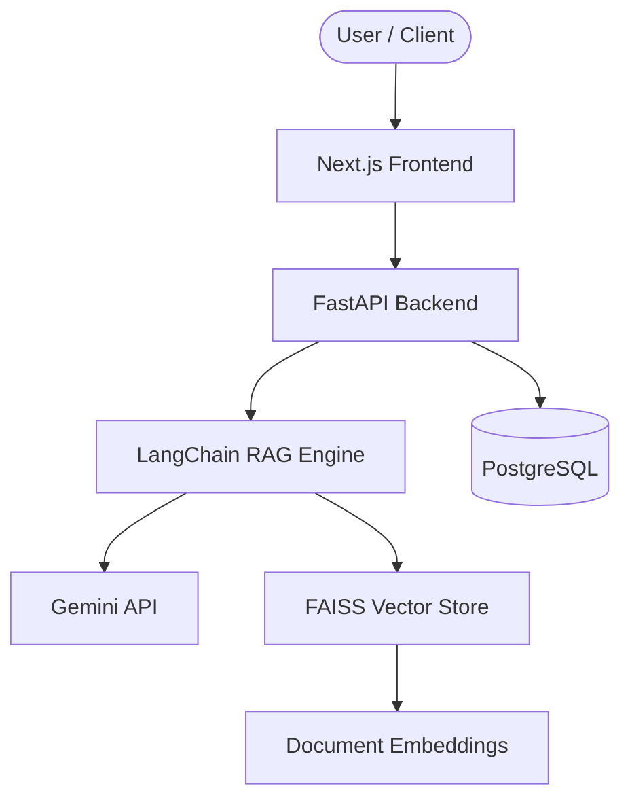

# NexusAI 🧠⚡

[](https://opensource.org/licenses/MIT)
[](CONTRIBUTING.md)
[](https://nextjs.org/)
[](https://fastapi.tiangolo.com/)
[](https://www.python.org/)
[](https://www.typescriptlang.org/)

NexusAI is an enterprise-grade AI Knowledge Workspace powered by Retrieval-Augmented Generation (RAG). It enables organizations to build, manage, and query intelligent knowledge bases using state-of-the-art AI models, providing accurate, context-aware responses grounded in your own data.

---

## 🌟 Key Features

- 🧠 **Intelligent RAG Pipeline** — Context-aware retrieval and generation using LangChain and Gemini API
- 📚 **Knowledge Base Management** — Upload, organize, and manage documents with automatic vectorization
- 🔍 **Semantic Search** — FAISS-powered vector similarity search for precise information retrieval
- 💬 **Conversational AI Interface** — Natural language chat with memory and context tracking
- 🔐 **Enterprise Authentication** — Role-based access control with secure session management
- 📊 **Analytics Dashboard** — Monitor usage, query patterns, and system performance
- 🐳 **Containerized Deployment** — Production-ready Docker setup with orchestration
- ⚡ **Real-time Streaming** — Server-sent events for live response streaming

---

## 🛠️ Tech Stack

| Layer | Technology |
|---|---|
| **Frontend** | Next.js 15, React, TypeScript, Tailwind CSS, shadcn/ui, Framer Motion |
| **Backend** | FastAPI, Python, LangChain, Gemini API |
| **Vector Store** | FAISS |
| **Database** | PostgreSQL |
| **Deployment** | Docker, Vercel, AWS |

---

## 🏗️ Architecture



---

## 📁 Project Structure

```
NexusAI/
├── frontend/             # Next.js 15 frontend application
│   ├── src/
│   │   ├── app/          # App router pages & layouts
│   │   ├── components/   # UI components
│   │   ├── hooks/        # Custom React hooks
│   │   ├── lib/          # Utilities & API clients
│   │   └── types/        # TypeScript type definitions
│   ├── public/           # Static assets
│   ├── package.json
│   └── tsconfig.json
├── backend/              # FastAPI backend application
│   ├── app/
│   │   ├── api/          # API endpoints / routes
│   │   ├── core/         # Config, security, database setup
│   │   ├── models/       # Database & Pydantic models
│   │   ├── services/     # RAG, FAISS, and LangChain services
│   │   └── main.py       # FastAPI app entrypoint
│   ├── tests/            # Pytest test suite
│   ├── requirements.txt
│   └── Dockerfile
├── docker-compose.yml    # Docker orchestration setup
├── .env.example          # Environment variables template
├── README.md             # Project documentation
├── LICENSE               # MIT License
├── CONTRIBUTING.md       # Contribution guidelines
├── CODE_OF_CONDUCT.md    # Contributor Covenant Code of Conduct
└── SECURITY.md           # Security policy
```

---

## 🚀 Getting Started

### Prerequisites

Ensure you have the following installed on your system:
- **Node.js**: `v20+`
- **Python**: `v3.11+`
- **Docker & Docker Compose**: Latest version
- **PostgreSQL**: `v15+` (or use Docker container)

### Installation

1. **Clone the Repository**
   ```bash
   git clone https://github.com/nexusai/nexusai.cmd
   cd RAG_chatbot
   ```

2. **Frontend Setup**
   ```bash
   cd frontend
   npm install
   ```

3. **Backend Setup**
   ```bash
   cd ../backend
   python -m venv venv
   source venv/bin/activate  # On Windows: venv\Scripts\activate
   pip install -r requirements.txt
   ```

4. **Environment Configuration**
   ```bash
   cp .env.example .env
   ```
   *Edit `.env` to supply your API keys, database credentials, and server configurations.*

5. **Run with Docker Compose**
   ```bash
   docker-compose up --build
   ```

### Development Commands

- **Start Frontend Dev Server**: `cd frontend && npm run dev`
- **Start Backend Dev Server**: `cd backend && uvicorn app.main:app --reload`
- **Run Backend Tests**: `cd backend && pytest`
- **Run Frontend Linter**: `cd frontend && npm run lint`

---

## 🗺️ Development Roadmap

- [x] **Phase 1: Foundation** — Project setup, authentication, base UI ✅
- [ ] **Phase 2: Core RAG** — Document ingestion, vectorization, retrieval pipeline
- [ ] **Phase 3: Chat Interface** — Conversational UI, streaming, context management
- [ ] **Phase 4: Enterprise** — Analytics, RBAC, audit logging, API keys
- [ ] **Phase 5: Scale** — Kubernetes, monitoring, multi-tenancy

---

## 🤝 Contributing

We welcome contributions from the community! Please read our [CONTRIBUTING.md](CONTRIBUTING.md) guide for details on our code of conduct, branch conventions, and submission process.

---

## 📄 License

This project is licensed under the MIT License - see the [LICENSE](LICENSE) file for details.

---

<p center align="center">Built with ❤️ by the NexusAI Team</p>
