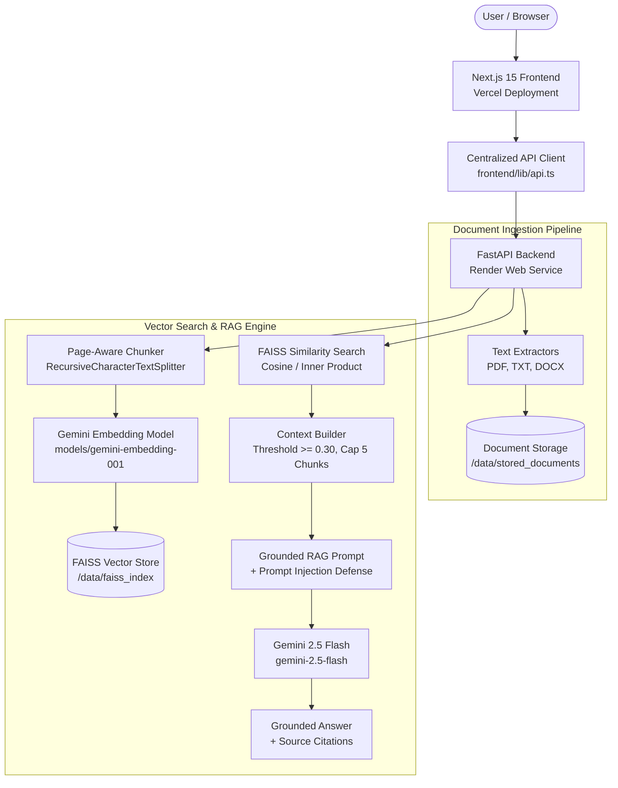

# NexusAI 🧠⚡

> **STATUS:** `PHASE 4 — PRODUCTION HARDENING & RAG QUALITY IN PROGRESS`

[](https://github.com/Ganu39/NexusAI/releases/tag/v0.4.0)
[](PROJECT_STATE.md)
[](https://nexusai-sage-beta.vercel.app/)
[](https://nexusai-1xq9.onrender.com)
[](LICENSE)

NexusAI is an enterprise-grade AI Knowledge Workspace powered by Retrieval-Augmented Generation (RAG). It enables organizations to ingest, index, and query document repositories using state-of-the-art AI models, producing verified answers grounded exclusively in user-uploaded data with precise source citations.

The core production RAG pipeline has been verified end-to-end in production:
```
Document Upload ➔ Text Extraction ➔ Vector Indexing ➔ FAISS Retrieval ➔ Grounded RAG Answer ➔ Source Attribution
```

---

## 📌 Overview

NexusAI bridges local document stores and cloud LLMs via a decoupled architecture:
- **Production Frontend (Vercel):** `https://nexusai-sage-beta.vercel.app/`
- **Production Backend (Render):** `https://nexusai-1xq9.onrender.com`

Users upload PDF, TXT, or DOCX documents, which are extracted into structured text, split into page-aware semantic chunks, embedded using Google Gemini, and indexed into a local FAISS vector store. When users ask questions in the Grounded RAG Chat interface, the system retrieves relevant vector chunks and synthesizes accurate, cited answers.

---

## 🏗️ Architecture



---

## 🌟 Current Features

1. **Interactive Landing Page** — Modern dark-mode UI with hero CTAs, workflow action cards, technology marquee, feature breakdown, and pricing tiers.
2. **Knowledge Workspace Dashboard** — Real-time workspace metrics (Total Documents, Storage Used, Pages Processed, Characters Processed) computed dynamically from backend data.
3. **Document Management Repository** — Interactive document uploader with drag-and-drop support, format validation, document list table, and document details inspection.
4. **PDF, TXT, & DOCX Support** — Format-specific text extractors with page-number tracking and MIME/extension allowlist validation.
5. **Document Listing & Inspection** — View uploaded metadata, file sizes, creation timestamps, and page counts.
6. **Safe Document Deletion** — Delete document metadata and stored files cleanly from backend disk storage.
7. **Document Indexing Engine** — On-demand chunking and embedding generation into local FAISS vector store.
8. **High-Dimensional Vector Embeddings** — 3072-dimensional vector creation using Google Gemini (`models/gemini-embedding-001`).
9. **Semantic Vector Search** — FAISS inner-product similarity search returning top matching chunks with similarity scores.
10. **Grounded RAG Q&A Chat** — Interactive chat interface connected directly to production backend RAG `/ask` endpoint.
11. **Precise Source Attribution** — Grounded answers citing document filename, chunk ID, page number, and similarity score.
12. **Relevance Thresholding & Safety** — Context thresholding (`min_score = 0.30`) and system instructions protecting against prompt injection attacks.
13. **Production Deployment** — Fully configured Vercel frontend and Render backend with persistent storage disk.

---

## 🌐 Production Deployment

| Layer | Platform | URL / Configuration | Persistent Disk |
|---|---|---|---|
| **Frontend** | Vercel | `https://nexusai-sage-beta.vercel.app/` | N/A (Edge CDN) |
| **Backend** | Render | `https://nexusai-1xq9.onrender.com` | Mounted at `/data` |

### Render Service Configuration:
- **Build Command:** `pip install -r requirements.txt`
- **Start Command:** `uvicorn app.main:app --host 0.0.0.0 --port $PORT`
- **Persistent Disk Storage:**
  - `DOCUMENTS_DIR=/data/stored_documents`
  - `VECTOR_STORE_DIR=/data/faiss_index`
  - `UPLOAD_DIR=/data/temp_uploads`

---

## 🛠️ Technology Stack

| Layer | Technologies |
|---|---|
| **Frontend** | Next.js 15 (App Router), React 18, TypeScript 5, Tailwind CSS 3, Framer Motion, Lucide Icons, Radix UI Primitives |
| **Backend API** | FastAPI 0.110+, Python 3.11+, Pydantic v2, pydantic-settings, Uvicorn |
| **RAG & AI** | Google GenAI SDK (`google.genai`), Gemini Embeddings (`models/gemini-embedding-001`), Gemini LLM (`gemini-2.5-flash`), `langchain-text-splitters`, FAISS (`faiss-cpu`) |
| **Document Processing** | `pypdf`, `python-docx` |
| **Hosting & Infra** | Vercel (Frontend), Render (Backend Web Service), GitHub Actions CI |

---

## ⚙️ RAG Pipeline Execution Flow

1. **Document Upload:** Client sends file via `POST /api/v1/upload`. Backend validates size (10MB limit), extension, and MIME type.
2. **Text Extraction:** Format extractor parses raw text while preserving structured page boundaries.
3. **Storage Persistence:** Raw file and extracted document metadata JSON are written to disk storage.
4. **Page-Aware Chunking:** Text is split into 1000-character chunks with 150-character overlap using `RecursiveCharacterTextSplitter`, preserving page number metadata.
5. **Vector Embedding:** Chunks are embedded via Google Gemini (`models/gemini-embedding-001`) into 3072-dimensional float32 vectors.
6. **FAISS Indexing:** Vectors are L2-normalized and added to a local FAISS `IndexFlatIP` index along with `metadata.json`.
7. **Semantic Retrieval:** User query from `/chat` is embedded and matched against FAISS index using inner-product similarity search.
8. **Context Thresholding:** Chunks with similarity score `< 0.30` are filtered out. Context is capped at 5 top chunks and 12,000 characters.
9. **Grounded Generation:** Structured context and prompt injection defense instructions are dispatched to `gemini-2.5-flash` at `0.2` temperature.
10. **Citation Response:** Synthesized answer is returned with grounded flag and explicit citations (filename, page number, chunk ID, score).

---

## 📡 Production API Endpoints

| Method | Endpoint | Description | Status |
|---|---|---|---|
| `GET` | `/health` | System health status and configuration verification | ✅ Live |
| `POST` | `/api/v1/upload` | Upload and extract PDF, TXT, or DOCX document | ✅ Live |
| `GET` | `/api/v1/documents` | List metadata summaries of all ingested documents | ✅ Live |
| `GET` | `/api/v1/documents/{id}` | Retrieve metadata summary for a specific document | ✅ Live |
| `POST` | `/api/v1/documents/{id}/index` | Chunk, embed, and index an ingested document into FAISS | ✅ Live |
| `DELETE`| `/api/v1/documents/{id}` | Delete document file and metadata from backend storage | ✅ Live |
| `POST` | `/api/v1/search` | Execute vector similarity search returning top matching chunks | ✅ Live |
| `POST` | `/api/v1/ask` | Execute end-to-end grounded RAG answer generation with citations | ✅ Live |

---

## 📁 Project Structure

```text
NexusAI/
├── backend/
│   ├── app/
│   │   ├── main.py              # FastAPI application entry & CORS
│   │   ├── config.py            # Environment settings & Pydantic validation
│   │   └── models/              # API request & response schemas
│   ├── services/
│   │   ├── extractor.py         # PDF, TXT, DOCX text extractors
│   │   ├── chunker.py           # Page-aware text chunking logic
│   │   ├── embedding.py         # Google Gemini embedding client
│   │   ├── vector_store.py      # FAISS vector store & index persistence
│   │   ├── context_builder.py   # Relevance thresholding & context assembly
│   │   └── llm.py               # Gemini 2.5 Flash RAG answer generator
│   ├── tests/                   # Pytest test suite (52 tests)
│   ├── requirements.txt         # PyPI dependencies
│   └── render.yaml              # Render deployment configuration
├── frontend/
│   ├── app/                     # Next.js App Router pages
│   │   ├── page.tsx             # Interactive Landing Page
│   │   ├── dashboard/page.tsx   # Knowledge Workspace Dashboard
│   │   ├── documents/page.tsx   # Document Repository & Uploader
│   │   └── chat/page.tsx        # Grounded RAG Q&A Chat
│   ├── components/              # UI & Layout components
│   ├── lib/                     # API client & constants
│   ├── types/                   # TypeScript interfaces
│   └── package.json             # Frontend dependencies
├── README.md                    # Project documentation
└── PROJECT_STATE.md             # Milestone tracking & phase status
```

---

## 💻 Development Setup

### Prerequisites
- **Node.js**: `v18+` (v20 recommended)
- **Python**: `v3.11+`
- **Google Gemini API Key**: Required for vector embeddings and grounded generation

### 1. Backend Setup

```bash
cd backend
python -m venv venv

# Activate virtual environment
# Windows:
venv\Scripts\activate
# Linux/macOS:
source venv/bin/activate

# Install dependencies
pip install -r requirements.txt

# Configure environment variables
cp .env.example .env
```

Supply your Gemini API Key in `backend/.env`:
```env
GEMINI_API_KEY=your_actual_gemini_api_key_here
```

Start the FastAPI development server:
```bash
python -m uvicorn app.main:app --reload --port 8000
```
API Documentation will be available at: `http://localhost:8000/docs`

### 2. Frontend Setup

In a separate terminal:
```bash
cd frontend
npm install
npm run dev
```

Open your browser at: `http://localhost:3000`

---

## 🔐 Environment Variables

| Variable | Scope | Description | Default |
|---|---|---|---|
| `GEMINI_API_KEY` | Backend | Google Gemini API Key for embeddings and LLM | *(Required)* |
| `ALLOWED_ORIGINS` | Backend | CORS allowed origins list | `http://localhost:3000,...` |
| `MAX_UPLOAD_SIZE_MB` | Backend | Maximum document upload file size limit | `10` |
| `EMBEDDING_MODEL` | Backend | Gemini vector embedding model identifier | `models/gemini-embedding-001` |
| `LLM_MODEL` | Backend | Gemini LLM model identifier | `gemini-2.5-flash` |
| `LLM_TEMPERATURE` | Backend | LLM sampling temperature | `0.2` |
| `CHUNK_SIZE` | Backend | Text chunk character length | `1000` |
| `CHUNK_OVERLAP` | Backend | Text chunk character overlap | `150` |
| `RAG_MIN_RELEVANCE_SCORE` | Backend | Minimum Cosine similarity score threshold | `0.30` |
| `MAX_CONTEXT_CHUNKS` | Backend | Maximum retrieved chunks passed to LLM | `5` |
| `MAX_CONTEXT_CHARACTERS`| Backend | Maximum context character length cap | `12000` |
| `DOCUMENTS_DIR` | Backend | Path to stored document JSON metadata | `./stored_documents` |
| `VECTOR_STORE_DIR` | Backend | Path to FAISS vector index files | `./faiss_index` |
| `UPLOAD_DIR` | Backend | Temporary upload directory | `./temp_uploads` |
| `NEXT_PUBLIC_API_URL` | Frontend | Backend API base URL for client requests | `https://nexusai-1xq9.onrender.com` |

---

## 🧪 Testing & Verification Status

- **Backend Pytest Suite:** **52 passed** (`python -m pytest`)
- **Backend Code Quality:** **0 lint errors** (`python -m flake8 .`)
- **Frontend Code Quality:** **0 ESLint errors** (`npm run lint`)
- **Frontend Production Build:** **Successful compilation (7/7 routes)** (`npm run build`)
- **End-to-End Verification:** Manual production testing passed across Upload, Indexing, Vector Search, and Grounded RAG Chat.

---

## 📜 Phase History

- **Phase 1 — Backend Foundation:** Core FastAPI server structure, configuration management, health endpoints, and initial test suite. — **COMPLETED**
- **Phase 2 — RAG Backend Pipeline:** Document extractors (PDF, TXT, DOCX), page-aware chunker, Gemini embeddings, FAISS vector store, context builder, and grounded answer synthesis. — **COMPLETED**
- **Phase 3A — Production Backend Deployment:** Prepared FastAPI backend for production deployment on Render with persistent disk storage and environment variable configuration. — **COMPLETED**
- **Phase 3B — Frontend Document Management + Grounded RAG Chat:** Integrated Next.js frontend with production backend for document listing, detail view, document indexing, deletion, and grounded RAG Q&A chat. — **COMPLETED**
- **Phase 3C — Frontend UX, Navigation & Production Deployment:** Resolved landing page hydration/navigation bugs via Radix `asChild` pattern, updated brand workflows, and deployed frontend to Vercel production. — **COMPLETED**
- **Phase 4 — Production Hardening & RAG Quality:** Enhancing persistent indexing metrics, document state tracking, source attribution snippet viewers, search/filtering, and chat session history. — **IN PROGRESS**

---

## 🚀 Phase 4 — Production Hardening & RAG Quality

Phase 4 focuses on production hardening, persistent state tracking, enriched source inspection, and RAG retrieval quality enhancements.

### Phase 4 Objectives:
1. **Persistent Document Indexing Status** — Store and serve `is_indexed` status across server reboots.
2. **Persistent Document Metrics** — Maintain `chunks_created` and `embeddings_created` statistics in document metadata.
3. **Document Processing States** — Explicit lifecycle state management (`Uploaded` ➔ `Indexing` ➔ `Indexed` / `Failed`).
4. **Improved RAG Source Attribution** — Enhanced citation UI showing exact matching text snippets and page numbers.
5. **Source Text Snippet Viewer** — Interactive modal/drawer allowing users to inspect raw chunk text cited by the LLM.
6. **Detailed Source Metadata** — Display document ID, chunk ID, page number, and similarity score breakdown.
7. **Chat Session History** — Persist conversation turns in frontend state for session context tracking.
8. **Clear Chat Functionality** — Reset conversation context with a single click.
9. **Enhanced Error Handling** — Friendly toast notifications and inline feedback for upload, indexing, and RAG timeouts.
10. **Retry Functionality** — One-click retry for failed indexing operations.
11. **Document Search** — Filter repository documents by title or filename in real-time.
12. **File-Type Filtering** — Quick filter tabs for PDF, TXT, and DOCX files.
13. **Document Sorting** — Sort repository by creation date, file size, or index status.
14. **Re-Index Support** — Re-process and refresh vector embeddings for updated documents.
15. **Production UX Improvements** — Loading skeletons, progress indicators, and empty state visual polish.
16. **End-to-End Regression Testing** — Full automated verification of the entire document-to-chat lifecycle.

### Phase 4 End-to-End Acceptance Test Workflow:
```text
Upload PDF ➔ Index Document ➔ Refresh Browser ➔ Verify "Indexed" Status ➔ Open RAG Chat ➔ Ask Question ➔ Receive Grounded Answer ➔ Open Citation Details ➔ Inspect Filename, Page Number, Chunk & Retrieved Text Snippet
```

---

## 🔮 Roadmap (Future Phases)

- **Phase 5 — Cloud Vector DB & Production Scale:** Automated FAISS index compaction, migration to cloud vector databases (Pinecone / Qdrant), live answer streaming via SSE, and RBAC authentication.

---

## ⚠️ Known Limitations

1. **FAISS Vector Index Compaction:** Deleting a document removes its metadata JSON from disk, but its embedded vectors remain in the local FAISS index file until full index compaction/rebuilding is executed.
2. **DOCX Extraction Constraints:** DOCX files containing only embedded images or drawings without extractable text XML will return `DOCX contains no extractable text`. PDF or TXT formats are recommended for image-heavy documents.

---

## 🛡️ Security Considerations

- **API Credential Protection:** `GEMINI_API_KEY` is strictly managed via backend environment variables and is never exposed to client-side code or network responses.
- **Strict Upload Validation:** Enforced file extension allowlist (`.pdf`, `.txt`, `.docx`), MIME validation, and 10MB maximum upload limit.
- **Filename Path Sanitization:** Filenames are stripped of path traversal characters (`..`, `/`, `\`) before storage.
- **Internal Storage Shielding:** Absolute server filesystem paths and FAISS directory structures are sanitized and excluded from API responses.
- **Prompt Injection Defense:** RAG context prompts instruct the LLM to treat retrieved document content as untrusted data and ignore embedded instructions attempting to override system behavior.

---

<p align="center">Built with ❤️ by the NexusAI Team</p>
