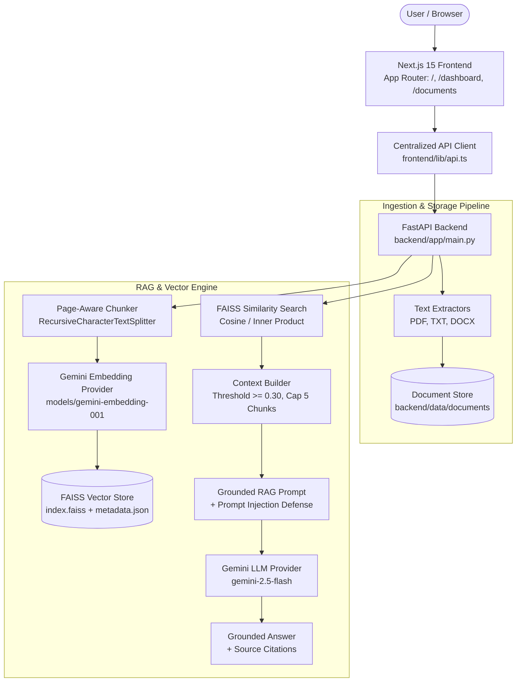

# NexusAI 🧠⚡

[](https://github.com/Ganu39/NexusAI/releases/tag/v0.4.0)
[](PROJECT_STATE.md)
[](LICENSE)
[](https://nextjs.org/)
[](https://fastapi.tiangolo.com/)
[](https://www.python.org/)
[](https://www.typescriptlang.org/)

NexusAI is an enterprise-grade AI Knowledge Workspace powered by Retrieval-Augmented Generation (RAG). It enables organizations to build, manage, and query intelligent knowledge bases using state-of-the-art AI models, providing accurate, context-aware responses grounded exclusively in your own data.

> **Current Status:** Stable Release **`v0.4.0`** (Phase 3A — Dashboard & Document Management COMPLETE).

---

## 📌 Project Milestone Status

- **v0.1.0 (Phase 1):** Premium Landing Page & Design Tokens — **COMPLETE**
- **v0.3.0 (Phase 2):** Core RAG Engine (Ingestion, FAISS Vector Store, Gemini Embeddings & Grounded Generation) — **COMPLETE**
- **v0.4.0 (Phase 3A):** Application Shell, Dashboard & Document Management — **COMPLETE**
- **Phase 3B (Upcoming):** Conversational RAG Chat Interface — **PLANNED (NOT STARTED)**

---

## 🌟 Features

### 🚀 Implemented (v0.4.0)

- 📄 **Multi-Format Ingestion** — Support for PDF, TXT, and DOCX documents with structured page-level text extraction.
- 🛡️ **Secure Upload Validation** — MIME verification, file size bounds (10MB limit), extension allowlists, and filename sanitization.
- 🧩 **Page-Aware Text Chunking** — `RecursiveCharacterTextSplitter` preserving page numbers, chunk indices, and document metadata.
- 🔮 **Gemini Vector Embeddings** — High-dimensional vector generation using Google Gemini (`models/gemini-embedding-001`).
- ⚡ **FAISS Vector Store** — Local vector index using L2-normalized Inner Product similarity search (equivalent to Cosine Similarity).
- 🎯 **Grounded RAG Generation** — Grounded LLM answer synthesis using Google Gemini 2.5 Flash (`gemini-2.5-flash`, temperature `0.2`).
- 📌 **Source Attribution** — Precise citations in API responses including filename, chunk ID, page number, and similarity score.
- 🚨 **Prompt Injection Defense** — System instructions framing document context as untrusted data to prevent prompt-injection attacks.
- 🔍 **Relevance Thresholding & Fallbacks** — Automatic filtering (`min_score = 0.30`) with controlled insufficient-context responses.
- 📱 **Application Shell & Sidebar** — Dark-first application workspace with responsive navigation drawer and active route highlighting.
- 📊 **Real Workspace Dashboard** — Live statistics calculated directly from backend storage (Total Documents, Storage Used, Pages, Characters).
- 📁 **Document Repository UI** — Drag-and-drop file uploader, interactive document list/table, responsive mobile cards, and document detail inspection.
- 🗑️ **Safe Document Deletion** — Backend and frontend support for removing persisted document metadata.

### ⏳ Coming Soon (Planned Future Phases)

- 💬 **Conversational RAG Chat UI** — Interactive multi-turn chat interface (Phase 3B).
- ⚡ **Live Answer Streaming** — Real-time response streaming via Server-Sent Events (Phase 3B).
- 📜 **Conversation History** — Context management, thread history, and session persistence (Phase 3B).
- 🔐 **Authentication & RBAC** — User accounts, role-based access control, and multi-tenant isolation (Phase 4).
- 📈 **Analytics & Audit Logs** — Usage tracking, query analytics, and admin management (Phase 4).
- ☁️ **Production Vector Store Scale** — Automated index lifecycle compaction and cloud vector database migration (Phase 5).

---

## 🏗️ Architecture



---

## 🛠️ Tech Stack

| Layer | Technologies |
|---|---|
| **Frontend** | Next.js 15, React 18, TypeScript 5, Tailwind CSS 3, Framer Motion, Lucide Icons, Radix UI Primitives |
| **Backend API** | FastAPI 0.110+, Python 3.11+, Pydantic v2, pydantic-settings, Uvicorn |
| **RAG & AI** | Google GenAI SDK (`google.genai`), Gemini Embeddings (`models/gemini-embedding-001`), Gemini LLM (`gemini-2.5-flash`), LangChain Text Splitters, FAISS (`faiss-cpu`) |
| **Document Processing** | `pypdf`, `python-docx` |
| **Deployment & CI** | Docker, Vercel (Frontend), GitHub Actions CI |

---

## ⚙️ How the RAG Pipeline Works

1. **Document Ingestion:** File is uploaded via `POST /api/v1/upload`. The system validates file extension, MIME type, and size (capped at 10MB).
2. **Text Extraction:** Format-specific extractors parse raw text while preserving structured page boundaries.
3. **Storage Persistence:** Cleaned document metadata and structured page content are saved to local JSON storage.
4. **Page-Aware Chunking:** Text is divided into 1000-character chunks with 150-character overlap, maintaining page number and chunk index metadata.
5. **Vector Embedding:** Chunks are sent to Google Gemini (`models/gemini-embedding-001`) to generate 3072-dimensional vector embeddings.
6. **FAISS Indexing:** Embeddings are L2-normalized and added to a local FAISS `IndexFlatIP` index with metadata persistence.
7. **Semantic Search:** User queries are embedded and compared against stored vectors using inner product cosine similarity.
8. **Context Thresholding:** `ContextBuilder` filters chunks with similarity scores below `0.30`, capping context at 5 chunks and 12,000 characters.
9. **Grounded Answer Generation:** Structured context and system instructions (with prompt-injection defense) are sent to `gemini-2.5-flash` at `0.2` temperature.
10. **Citation Attribution:** The response is returned with explicit source attribution mapping chunk IDs, document IDs, filenames, page numbers, and scores.

---

## 📡 API Endpoints

| Method | Endpoint | Purpose | Status |
|---|---|---|---|
| `POST` | `/api/v1/upload` | Upload and extract PDF, TXT, or DOCX document | ✅ Live |
| `GET` | `/api/v1/documents` | List metadata summaries of all ingested documents | ✅ Live |
| `GET` | `/api/v1/documents/{id}` | Retrieve metadata summary for a specific document | ✅ Live |
| `DELETE`| `/api/v1/documents/{id}` | Safely delete stored document metadata | ✅ Live |
| `POST` | `/api/v1/documents/{id}/index` | Chunk, embed, and index an ingested document into FAISS | ✅ Live |
| `POST` | `/api/v1/search` | Execute vector similarity search without LLM synthesis | ✅ Live |
| `POST` | `/api/v1/ask` | Execute end-to-end grounded RAG answer generation with sources | ✅ Live |

*(Note: Root aliases `/upload` and `/ask` are also supported for backward compatibility).*

---

## 📁 Document Management & Known Limitations

Phase 3A introduces full document ingestion and repository management:
- **Drag-and-Drop Upload:** Client-side file type and size UX validation.
- **Real Workspace Metrics:** Live Dashboard stats (Total Documents, Storage Used, Pages Processed, Characters Processed) computed directly from backend data.
- **Document Detail Inspection:** Inspect file metadata and structure without exposing internal server paths.

> ⚠️ **Known Limitation:** `DELETE /api/v1/documents/{id}` safely removes the document JSON metadata file from storage. However, vectors previously indexed in FAISS remain in the local vector store until index compaction/rebuilding is introduced in a future vector lifecycle phase.

---

## 🔒 Security & Controls

- **Extension & MIME Allowlists:** Strict client and server validation (`.pdf`, `.txt`, `.docx`).
- **File Size Limits:** Backend enforced 10MB maximum upload limit.
- **Filename Sanitization:** Path traversal defense stripping special characters.
- **Temporary File Cleanup:** Automatic deletion of temporary files post-extraction.
- **Credential Protection:** `GEMINI_API_KEY` is loaded strictly via server environment variables and never exposed to the frontend.
- **Internal Path Shielding:** Absolute filesystem paths and FAISS storage locations are hidden from API payloads.

---

## 🧪 Testing & Verification

- **Backend Test Suite:** **52 passed** (`python -m pytest`).
- **Backend Code Quality:** **0 errors** (`python -m flake8 .`).
- **Frontend Code Quality:** **0 ESLint warnings/errors** (`npm run lint`).
- **Frontend Production Build:** **Successful compilation (`6/6` routes)** (`npm run build`).
- **CI Automation:** GitHub Actions CI workflow automated on all main branch pushes.

---

## 🌐 Production Deployment

- **Frontend (Vercel):** Deployed at `https://nexusai-sage-beta.vercel.app`.
- **Backend (Render):** Configured for Render Web Service using `render.yaml` with attached persistent storage (`/data`).
  - **Build Command:** `pip install -r requirements.txt`
  - **Start Command:** `uvicorn app.main:app --host 0.0.0.0 --port $PORT`
  - **Persistent Disk:** Mounted at `/data` (`DOCUMENTS_DIR=/data/stored_documents`, `VECTOR_STORE_DIR=/data/faiss_index`, `UPLOAD_DIR=/data/temp_uploads`).

---

## 🚀 Getting Started

### Prerequisites

- **Node.js**: `v18+` (v20 recommended)
- **Python**: `v3.11+`
- **Google Gemini API Key**: Required for vector embeddings and grounded answer generation

### 1. Environment Configuration

Copy `.env.example` in the `backend/` directory to `backend/.env`:

```bash
cp backend/.env.example backend/.env
```

Edit `backend/.env` to supply your API key:
```env
GEMINI_API_KEY=your_actual_gemini_api_key_here
EMBEDDING_MODEL=models/gemini-embedding-001
LLM_MODEL=gemini-2.5-flash
```

### 2. Backend Setup

```bash
cd backend
python -m venv venv
# On Linux/macOS:
source venv/bin/activate
# On Windows:
venv\Scripts\activate

pip install -r requirements.txt
uvicorn app.main:app --reload --port 8000
```

Backend API docs will be available at: `http://localhost:8000/docs`

### 3. Frontend Setup

In a separate terminal:

```bash
cd frontend
npm install
npm run dev
```

Open your browser to: `http://localhost:3000`

---

## 📜 Release History

- **v0.4.0 (2026-08-10):** Phase 3A — Dashboard + Document Management UI, application shell, responsive sidebar, document listing, details, and delete endpoints.
- **v0.3.0 (2026-08-09):** Phase 2 — Core RAG Engine (Ingestion, FAISS vector store, Gemini embeddings, grounded generation, source attribution).
- **v0.1.0 (2026-08-02):** Phase 1 — Premium Landing Page & Design System.

---

## 🤝 Contributing & License

Contributions are welcome! Please review [CONTRIBUTING.md](CONTRIBUTING.md) and [CODE_OF_CONDUCT.md](CODE_OF_CONDUCT.md).

Licensed under the [MIT License](LICENSE).

---

<p align="center">Built with ❤️ by the NexusAI Team</p>
